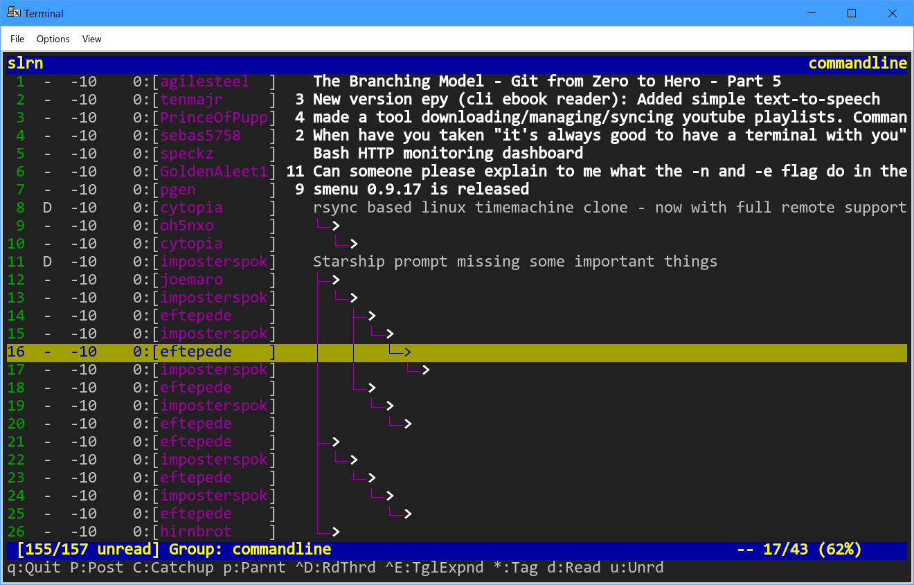
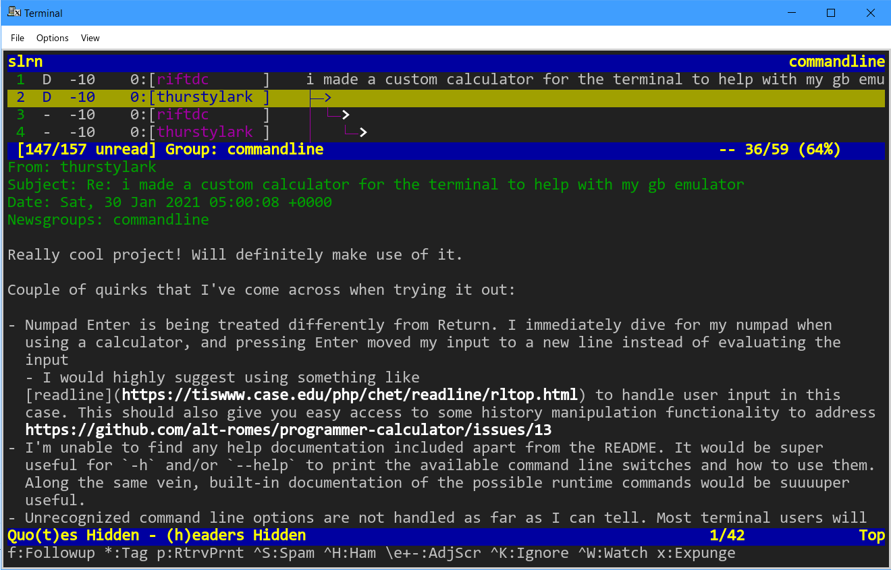
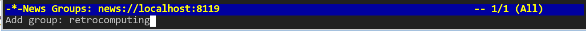

# nntpit

This is a simple reddit2nntp gateway server that lets you use a newsreader to
follow discussions on reddit. The intention is for you to run it locally, tell
your newsreader to connect to localhost, and subreddits will appear as
newsgroups!





> This software is in an early experimental state, you **will** encounter bugs.

# Building

You need `libev-dev`, `libglib2.0-dev`, `libjson-c-dev` and `libcurl4-openssl-dev`.

To make the configure script:

```bash
$ autoreconf -i
```

Now type the usual `./configure`, `make`.

# Usage

`$ ./nntpit -D -p 8119`

Now connect your newsreader, if you use slrn, you would do this:

`$ NNTPSERVER=news://localhost:8119 slrn -f reddit --create`

The groups list will be empty at first, but don't worry, that's normal.

Press `a` to add a group, and type the name of the subreddit you want to subscribe to.



> Don't include the `/r/`!

It should populate a list of articles and comments for you to read.

# Reporting Bugs

If you're using slrn, please include the `--debug`, and the nntpit `-D` log.

If you're not using slrn, please include as much detail as you can, and any
debugging logs your software can generate. Please be willing to help test!

# Credit

The nntp code is based on [nntpsink](https://github.com/unixwitch/nntpsink) by
Felicity Tarnell (@unixwitch).

All other code is by @taviso.

# Why?

I prefer to read discussions in a newsreader. There are many powerful features
that we never got back when the world moved away from usenet.

There are the simple things like keeping track of which posts you've read or
haven't seen yet, and customizing how threads are sorted and displayed.

There's more advanced features like tagging, watching, ignoring and so on. Have you
ever been following a discussion, but it's wandered off topic and people are now
discussing something you're not interested in? Well newsreaders let you ignore
subthreads, but continue reading the rest without the clutter.

Then there are poweruser features like scoring and macros.

## Scoring

Most newsreaders will let you adjust the score of an article based on rules. A
post with a high score will be higlighted, low scores might be dimmed, and very
low scores might be completely hidden. You could also sort by score, so the best
comments are at the top, and you read those first.

The simplest example would be if there's a user who's posts you always enjoy you
can score their posts higher. Their comments will be hilighted and you'll never
miss them.

You can chain complicated sets of rules together, really customizing your
experience. Let's say you want to hilight all the cookie recipes posted by
cookielover22, unless they contain the word "chocolate" because you're allergic.
No problem, you can do that too.

How about assigning scores for different ingredients you like, then sorting all
the comments by score?

| Keyword    | Score  |
| ---------- | ------ |
| Chocolate  |  -10   |
| Raisins    |  +20   |
| Nuts       |  +15   |

Now a post for "New Recipe for Chocolate Raisin Brownies!!" will be scored -10+20+15 = 25, and
so on.

If you want to read about scoring, the slrn documentation is [here](https://slrn.info/docs/score.txt).

# How?

I have only tested this with the newsreader I use, slrn.

It *might* work with other newsreaders, but most likely I will need to make some
changes. If you're willing to help with testing to get it working, then file an
issue and let's see if we can make it work!

# What about...

## Gwene

> Gwene is an rss2nntp gateway, reddit supports rss so why not use that?

Rss doesn't support threading, and makes each story appear as a new group.

You need to subscribe to every single story, and miss out on half the features,
so it just doesn't work.

## Posting

> Can I post replies?

No, reading only. Maybe one day.

